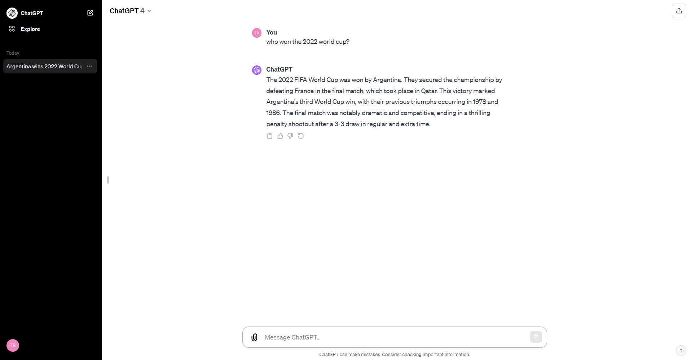

```
Note that this lab requires a ChatGPT Plus subscription in order to use GPT-4 and the beta features.
```

Welcome to the optional ChatGPT Lab! This guide will walk you through exploring more advanced functionalities of GPT-4, like real-time data search with Bing, advanced task completion with plugins, and advanced data analysis

## Step 1: Turning Beta features on

1. At the current time, some of these features are still in Beta mode, and are only accessible to ChatGPT Plus users, to turn that on, click on your account name in the bottom-left of the page and click on 'Settings & Beta'.
2. Next click on 'Beta features' and make sure all of the features are enabled, in order to continue this lab.


## Step 2: Real-time data

Let's begin by getting familiar with the ChatGPT Plus interface:

1. Select GPT-4 from the top of the screen to start working with more advanced features.
   
   
 2. GPT-4 is continuously trained with up-to-date data and can search the web for new information.
	 
  
## Step 3: Advanced capabilities using Plugins
  

One of the major updates of ChatGPT was the addition of third-party plugins, this enables ChatGPT Plus users (for now) to use more features tailored for specific use cases without waiting for OpenAI to release such features. Developers can release their plugins on the plugin store for users to install and use.
  

1. From the top of the screen, select `Plugins`, 
   
2. You can now select from different plugins you install, to install a plugin click on "Plugin store".
   

3. Take a look around to see examples of different plugins
    

5. Here we can choose from different plugins based on our needs, let's try one of them as an example
6. From the plugin store, search for 'Canva' and install the Canva plugin.
    

7. Click on "ChatGPT Plugins" and enable the Canva plugin.


8. Let's try to generate a logo for a coffee shop by writing:
> i need a logo for my coffee shop
9. ChatGPT will generate a few logos based on the prompts.

   
  

## Step 4: GPTs

   1. Click on the `Explore` button at the top left corner.
   2. Explore the GPTs page sections.
	- My GPTs: this section contains your created GPTs.
	- Recently Used: this section contains the GPTs you have recently tried out.
	- Made by OpenAI: this section contains official GPTs made by OpenAI.
	   

3. Let's create our first GPT! from the 'My GPTs' section, click on `Create a GPT`.
4. This opens the GPT Builder page, explore the GPT builder menu.
	

5. GPT Builder is a chat interface which helps us create custom GPTs for specific use cases and with custom personalities. It's a more advanced 'Custom Instructions' and allows you to create multiple custom GPT personalities and even publish them for others to use.
	Let's start building a simple GPT for YouTube script generation.
	
	GPT Builder will ask you questions to help you customize your new GPT using a chat interface.

6. Click on `Configure` at the top of the GPT builder chat interface.
	
	Here we see the actual configuration of our new GPT which GPT Builder Chat was populating automatically for us before.
	We can even upload files for our GPT to learn from, or change any of the configuration from here.

7. You can test out your GPT at any time from the 'Preview' Chat interface on the right.
   Explore and customize your new GPT based on your preferences.

8. When we are done building our new GPT, we can save it for future use or even make it public, let's save it as private for now, from the top right of the screen, click on `Save`, choose the 'Only me' option, and finally 'Confirm' to save your new GPT.
	

9. Our new GPT is now saved and we can access it any time from the explore menu.
	

## Step 5: Advanced Data Analysis

Another great beta feature provided is advanced data analysis, let's try it out.

1. Download the provided excel file to use with ChatGPT, or use any other excel file of your choice to analyse the contents.
   from [data/data_rdd.csv](data/data_rdd.csv)
2. From the `Explore` menu, choose "Data Analysis".
   
3. Drag and drop the excel file into the chat to upload it, and start asking questions.
	Note that in the below screenshot, the file did not open with ChatGPT due to an encoding issue, but ChatGPT automatically resolved this by trying a different encoding, it also shows it's thought process to give us more information.
   

What just happened is mind-blowing, ChatGPT was able to recognize that this file is using 'ISO-8859-1' encoding and used that knowledge to read the file

4. Next ask ChatGPT to provide a summary of the data in the file

   

  
5. Ask ChatGPT for more advanced data science and data engineering information like 'Create a bar chart showing the distribution of prices for the hotels'

   
6. Ask more questions like:
- How many hotels are in each location?
- Which hotel offers the largest discounts
- Plot a histogram of bubble_rating to see the distribution of ratings across all hotels.
- Which region has the highest average hotel price?
- Which hotel has the highest views?
- Visualize the relationship between discounts and max prices using a scatter plot. 
- What is the average, median, and range of hotel prices?
- Are there any correlations between hotel price and other variables like rating, amenities, or location?
- Which hotels have the highest and lowest ratings?
- Choose the top 10 amenities and display them on a bar chart to see which amenities are most common among the hotels.
- How does hotel price correlate with its rating?
- Show the locations of hotels in a pie graph
- Are there any hotels with a large number of reviews but a low rating or vice versa?
- Give the hotel URL for the most expensive hotel
- Can we cluster hotels based on their digital presence using the hotel_url and views columns?
- Graph the data distribution based on hotel amenities


## Tips and Notes

  
- Remember to be kind and respectful when interacting with AI.
- Try different ways of asking questions to see how AI responds.
- Experiment with different prompt styles: declarative, interrogative, creative, etc.
- Don't worry if things don't work perfectly at first; learning and improving is part of the process.
- Reach out to OpenAI's support or online communities if you need help or have questions.

  
Congratulations! You've completed the ChatGPT Lab Course and gained valuable insights into utilizing AI for enhancing business processes. Your understanding of ChatGPT and AI's potential has expanded, enabling you to apply these skills in various real-world scenarios. Happy experimenting! 🚀
