Welcome to the ChatGPT Lab! This guide will walk you through the process of creating an account, getting familiar with the interface, exploring functionalities and settings, experimenting with different prompts, and even building a business model with the help of AI.

## Step 1: Creating Your Account

Let's begin by setting up your ChatGPT account:

1. Go to the [ChatGPT website](https://www.openai.com/chatgpt/).
2. Click on the `Try ChatGPT` button.
   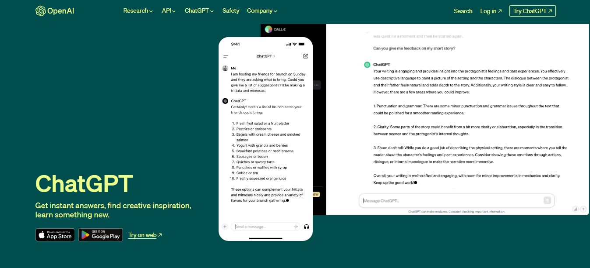
3. In the following page, click on `Sign Up`
   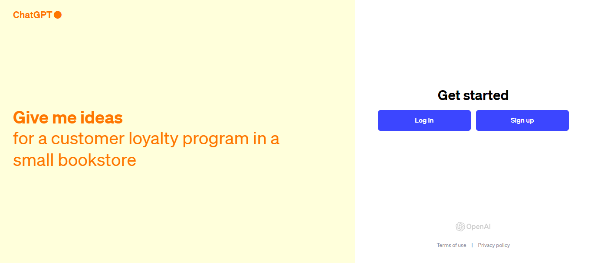
4. Fill in your email and create a password, or sign up directly with one of the 3 options below.
   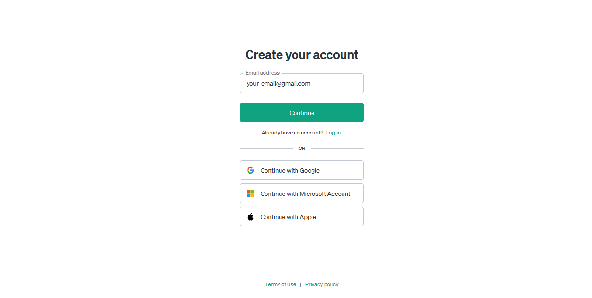
   
5. You will be sent a verification link to your email.
   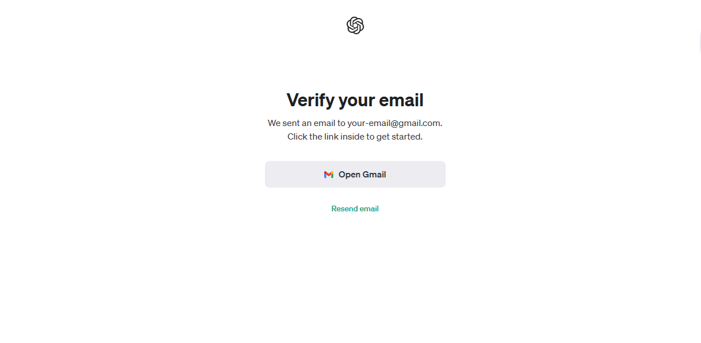
6. Check your email for a verification link and click on it.
   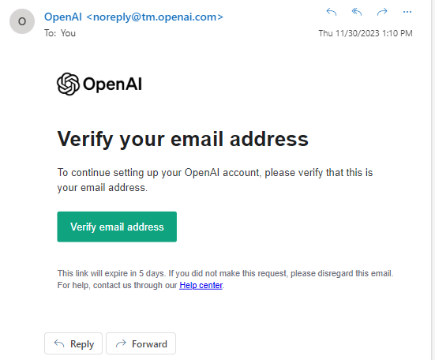

## Step 2: Getting Comfortable with the Interface

Now that you have an account, let's explore the ChatGPT interface:

1. Log in using your newly created account.
   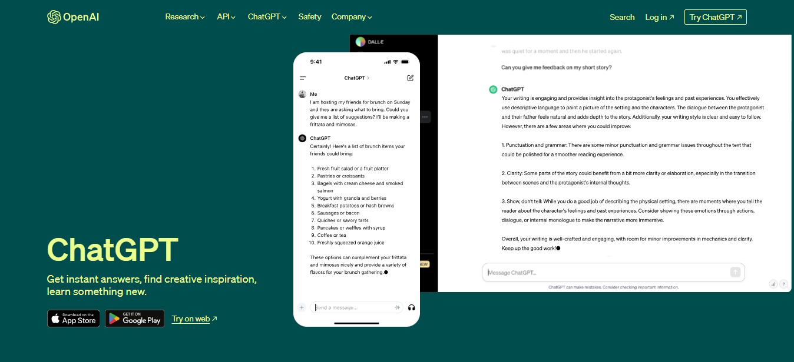
2. Specify 'ChatGPT' from the following page.
   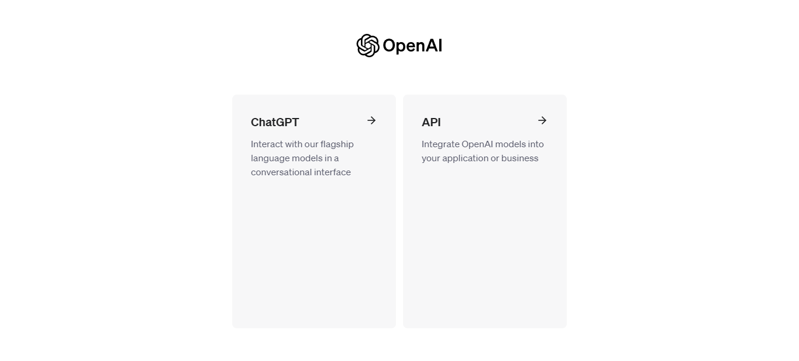
3. Take a look around to see where things are located.
   Note that 'GPT-4' is locked at the top of the page, this is because the GPT-4 model is only available to ChatGPT Plus users
   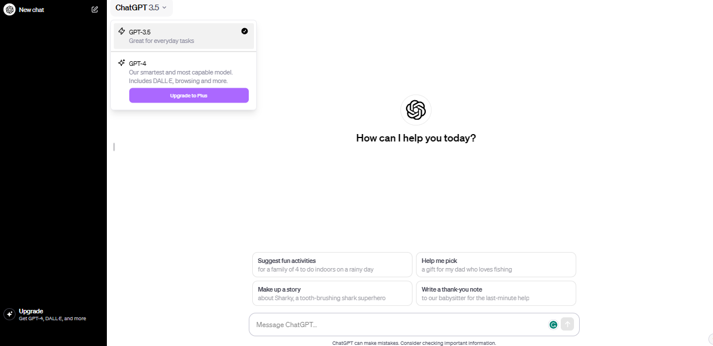
4. Familiarize yourself with the layout of the dashboard, including navigation menus and options.

## Step 3: Exploring Functionalities and Settings

1. Navigate to the settings section of the interface, by clicking on your name in the bottom-left, then Settings.
   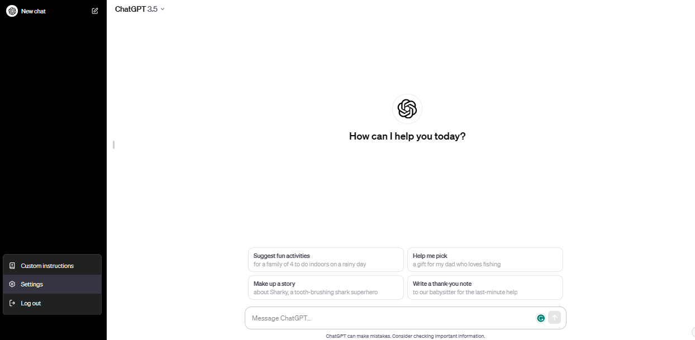
2. Explore options like changing the theme, you can also clear all your chat history from this menu
   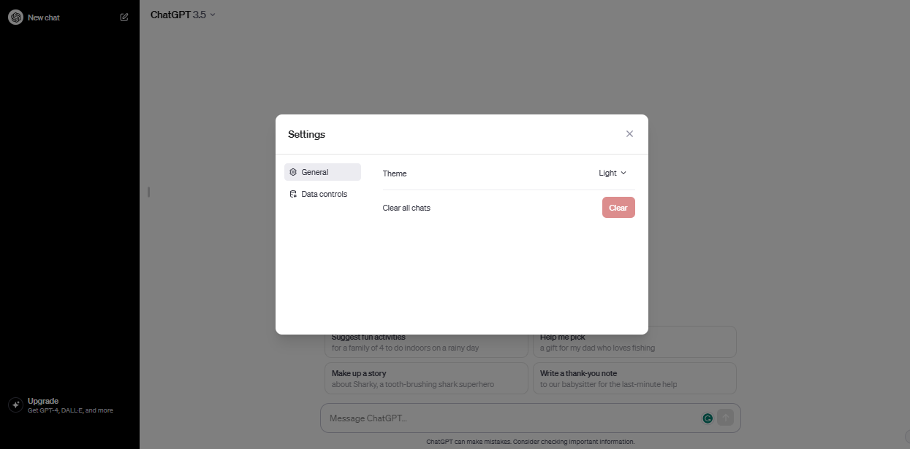

3. From the bottom-left menu, select 'Custom Instructions' and click 'OK'
4. Here we can specify custom instructions to ChatGPT like some context about who we are and what are our goals, in addition to describing the model itself, like what is it called and what it should refer to you as.
   Make sure to enable 'Enable for new chats' in order to set instructions.
   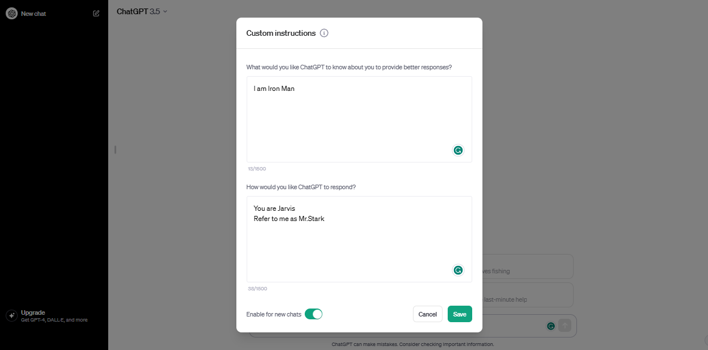

## Step 4: Trying Different Chat Prompts

Prompts are how you talk to ChatGPT. Let's give it a try:

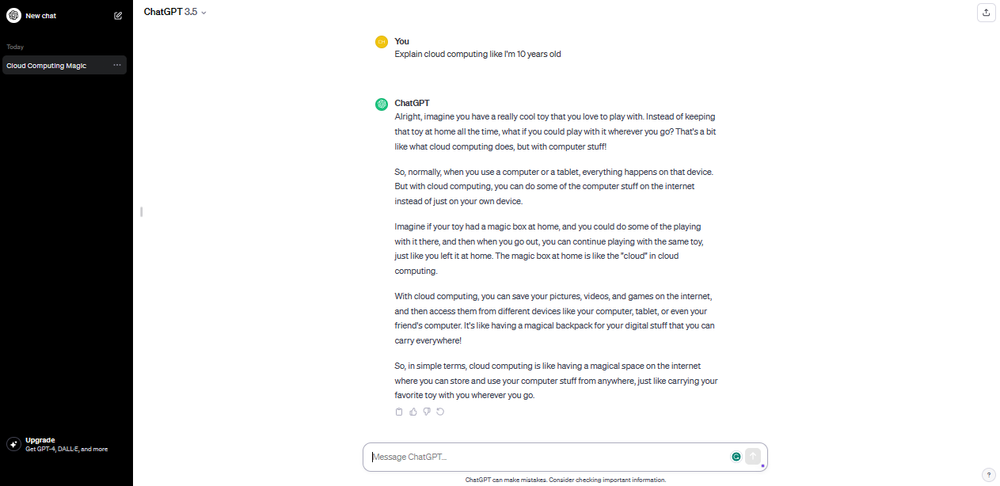

1. Start by entering a simple prompt in the input box, such as "Tell me a joke."
2. Observe the AI's response in the output area.
3. Experiment with different prompts, like asking for information, creative writing, or solving problems.
4. Explore prompts that require longer responses to see how ChatGPT constructs coherent paragraphs.

### Example Prompts:

- "Explain the concept of photosynthesis."
- "Tell me an interesting fact about dogs."
- "What are the benefits of regular exercise?"
- "Write a dialogue between two time travelers meeting in ancient Egypt."
- "Describe the sensation of floating in zero gravity."
- "Craft a scene where a detective confronts their prime suspect."
- "Write a letter from a character apologizing for a misunderstanding."
- "Describe a secret underground library hidden beneath a bustling city."
- "Write a monologue from the perspective of a sentient AI reflecting on its existence."
- "Describe a post-apocalyptic world where nature has reclaimed urban landscapes."
- "Write a conversation between two animals observing humans for the first time."
- "Describe the emotions of a painter as they complete their masterpiece."
- "Craft a scene where a character discovers a long-lost family heirloom."
- "Write a poem about the beauty of a thunderstorm."
- "Describe the sensation of stepping into a different dimension."
- "Write a dialogue between two rival superheroes forced to work together."
- "Create a character sketch of an eccentric but brilliant scientist."
- "Describe the sights, sounds, and smells of a bustling Asian night market."
- "Write a short story about a mischievous magical creature causing chaos in a small village."
- "Describe the moment a time traveler realizes they've altered history by mistake."
- "Craft a scene where a character confronts their fear and overcomes it."
- "Write a letter from a character to their future self, offering advice and encouragement."
- "Describe the view from a mountaintop at sunrise."

## Step 5: Exploring OpenAI Playground

1. Visit the OpenAI Playground: [https://platform.openai.com/playground](https://platform.openai.com/playground)
2. This is an interactive interface to experiment with various OpenAI models, including ChatGPT.
3. Spend some time getting familiar with the interface and features available.
   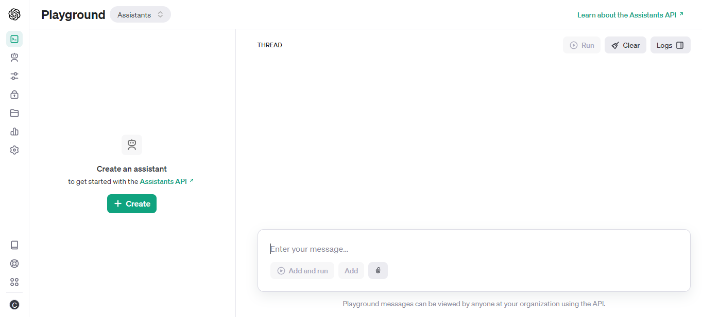

### Step 5a: Creating an Assistant

1. Click on the `+ Create` button in green
   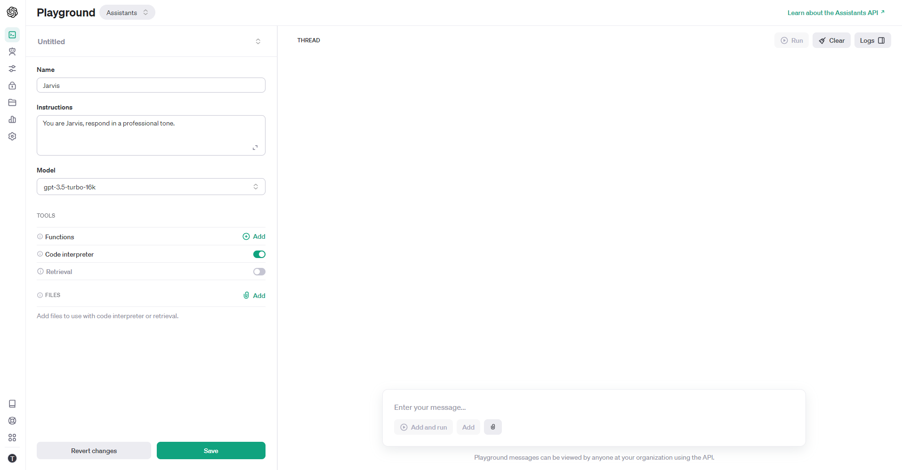
2. Specify a name for your new assistant, add some instructions and choose an available model, this will create a new GPT assistant with any personality you desire.
3. Check `Code Interpreter` to give your assistant the ability to write and run code.
4. Save your new assistant by clicking on `Save`.
5. You can now chat with your new assistant! Try entering a message and click `Add and run`.
6. Try changing the different features for your new assistant and see how the outcome can be customized.
   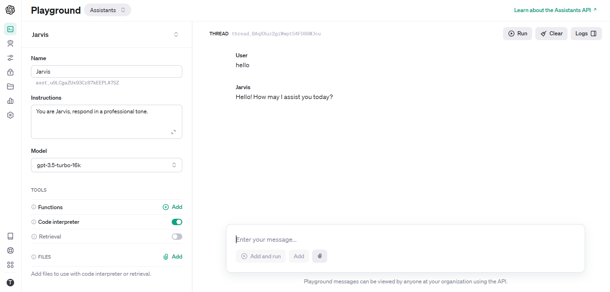

### Example Prompts:

- "Give me a recipe for a delicious sandwich."
- "Write a short poem about the stars in the sky."
- "Imagine you're a detective solving a mystery. Describe your investigation."

## Step 6: Build a Business Module with AI

1. Consider a hypothetical business or organization structure.
2. Start by outlining the different departments, roles, and responsibilities within the organization.

### Example Business Module:

- Business: Online Bookstore
- Departments: Marketing, Sales, Customer Support, Warehouse
- Roles: Marketing Manager, Sales Representative, Customer Support Specialist, Warehouse Coordinator

3. Create a new assistant with instructions detailing the previous information.

### Example Interactions:

- "As the Marketing Manager, draft a promotional email for an upcoming book sale."
- "A customer asks about a delayed shipment. Respond as the Customer Support Specialist with an apology and solution."

4. Explore how AI-generated responses can enhance and advance the business module.

## Tips and Notes

- Remember to be kind and respectful when interacting with AI.
- Try different ways of asking questions to see how AI responds.
- Experiment with different prompt styles: declarative, interrogative, creative, etc.
- Don't worry if things don't work perfectly at first; learning and improving is part of the process.
- Reach out to OpenAI's support or online communities if you need help or have questions.

Congratulations! You've completed the ChatGPT Lab Course and gained valuable insights into utilizing AI for enhancing business processes. Your understanding of ChatGPT and AI's potential has expanded, enabling you to apply these skills in various real-world scenarios. Happy experimenting! 🚀

Explore ChatGPT in more detail in this [Optional Lab](Day1%20Lab%20Optional.md).
This lab is optional because it requires a ChatGPT-Plus subscription, we will explore GPT-4 features, including real-time data, add-on plugins, GPTs, and advanced data analysis...
