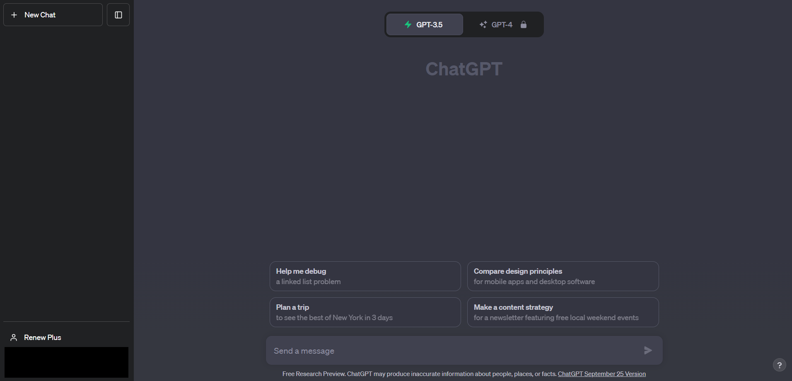
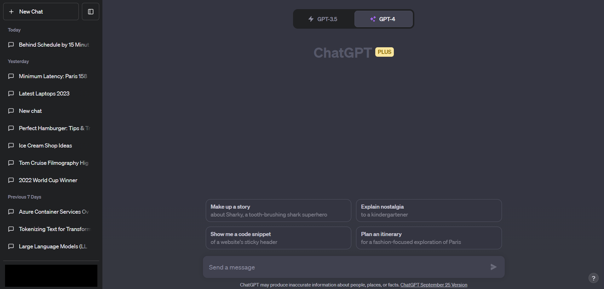
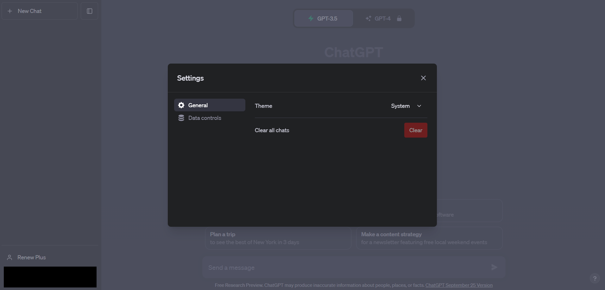
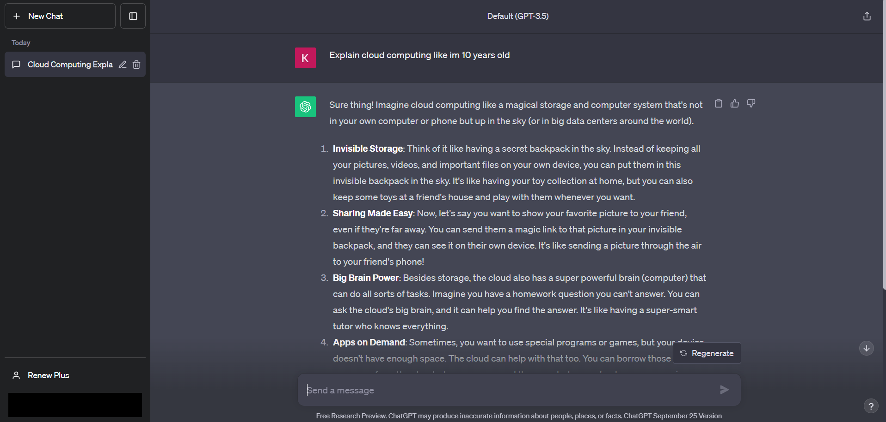

# ChatGPT Lab Guide

Welcome to the ChatGPT Lab! This guide will walk you through the process of creating an account, getting familiar with the interface, exploring functionalities and settings, experimenting with different prompts, and even building a business model with the help of AI.

## Step 1: Creating Your Account

Let's begin by setting up your ChatGPT account:

1. Go to the [ChatGPT website](https://www.openai.com/chatgpt/).
2. Click on the "Sign Up" or "Create Account" button.
   
3. Fill in your email and create a password.
   
4. Check your email for a verification link and click on it.
   
   

## Step 2: Getting Comfortable with the Interface

Now that you have an account, let's explore the ChatGPT interface:

1. Log in using your newly created account.
   
   
2. Take a look around to see where things are located.
   
3. Familiarize yourself with the layout of the dashboard, including navigation menus and options.
   

## Step 3: Exploring Functionalities and Settings

1. Navigate to the settings section of the interface.
   
2. Explore option like changing the theme
   

## Step 4: Trying Different Chat Prompts

Prompts are how you talk to ChatGPT. Let's give it a try:

1. Start by entering a simple prompt in the input box, such as "Tell me a joke."
2. Observe the AI's response in the output area.
3. Experiment with different prompts, like asking for information, creative writing, or solving problems.
4. Explore prompts that require longer responses to see how ChatGPT constructs coherent paragraphs.

### Example Prompts:

- "Explain the concept of photosynthesis."
- "Tell me an interesting fact about dogs."
- "What are the benefits of regular exercise?"
- "Write a dialogue between two time travelers meeting in ancient Egypt."
- "Describe the sensation of floating in zero gravity."
- "Craft a scene where a detective confronts their prime suspect."
- "Write a letter from a character apologizing for a misunderstanding."
- "Describe a secret underground library hidden beneath a bustling city."
- "Write a monologue from the perspective of a sentient AI reflecting on its existence."
- "Describe a post-apocalyptic world where nature has reclaimed urban landscapes."
- "Write a conversation between two animals observing humans for the first time."
- "Describe the emotions of a painter as they complete their masterpiece."
- "Craft a scene where a character discovers a long-lost family heirloom."
- "Write a poem about the beauty of a thunderstorm."
- "Describe the sensation of stepping into a different dimension."
- "Write a dialogue between two rival superheroes forced to work together."
- "Create a character sketch of an eccentric but brilliant scientist."
- "Describe the sights, sounds, and smells of a bustling Asian night market."
- "Write a short story about a mischievous magical creature causing chaos in a small village."
- "Describe the moment a time traveler realizes they've altered history by mistake."
- "Craft a scene where a character confronts their fear and overcomes it."
- "Write a letter from a character to their future self, offering advice and encouragement."
- "Describe the view from a mountaintop at sunrise."

## Step 5: Exploring OpenAI Playground

1. Visit the OpenAI Playground: [https://platform.openai.com/playground](https://platform.openai.com/playground)
2. This is an interactive interface to experiment with various OpenAI models, including ChatGPT.
3. Spend some time getting familiar with the interface and features available.
   

### Step 5a: Familiarize with the Playground Interface

1. Look for the text input area where you can enter prompts.
2. Notice the options for adjusting parameters like temperature and max tokens.
3. Experiment with different settings to observe their impact on AI-generated responses.
   

### Step 5b: Trying Different Prompts

1. Enter prompts of varying complexity in the input box.
2. Observe the AI's responses in the output area.
3. Test prompts related to creative writing, problem-solving, or generating ideas.
   

### Example Prompts:

- "Give me a recipe for a delicious sandwich."
- "Write a short poem about the stars in the sky."
- "Imagine you're a detective solving a mystery. Describe your investigation."

## Step 6: Build a Business Module with AI

1. Consider a hypothetical business or organization structure.
2. Start by outlining the different departments, roles, and responsibilities within the organization.

### Example Business Module:

- Business: Online Bookstore
- Departments: Marketing, Sales, Customer Support, Warehouse
- Roles: Marketing Manager, Sales Representative, Customer Support Specialist, Warehouse Coordinator

3. Use ChatGPT to simulate interactions within the organization.
   

### Example Interactions:

- "As the Marketing Manager, draft a promotional email for an upcoming book sale."
- "A customer asks about a delayed shipment. Respond as the Customer Support Specialist with an apology and solution."

4. Explore how AI-generated responses can enhance and advance the business module.

## Tips and Notes

- Remember to be kind and respectful when interacting with AI.
- Try different ways of asking questions to see how AI responds.
- Experiment with different prompt styles: declarative, interrogative, creative, etc.
- Don't worry if things don't work perfectly at first; learning and improving is part of the process.
- Reach out to OpenAI's support or online communities if you need help or have questions.

Congratulations! You've completed the ChatGPT Lab Course and gained valuable insights into utilizing AI for enhancing business processes. Your understanding of ChatGPT and AI's potential has expanded, enabling you to apply these skills in various real-world scenarios. Happy experimenting! 🚀
